## E-Ticaret Sitesi Front-End

Web Tasarım Dersi kapsamında yapmayı tercih ettiğim E-Ticaret sitesinin front end kısmı tamamlandı.
Bu projenin front end kısmı tamamlandı.
Kullanılan teknolojiler Html 5, CSS 3, JavaScript , Jquery ve Bootstrap.
Backend tarafında ise C# Asp.Net ve Veri Tabanı olarakta MsSql kullanılacaktır.

---------

## AnaSayfa (Home Page)

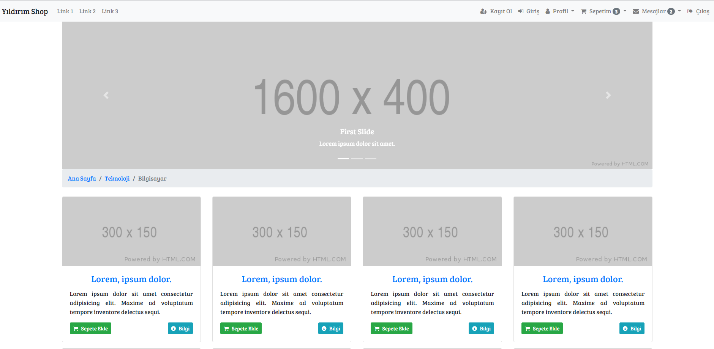

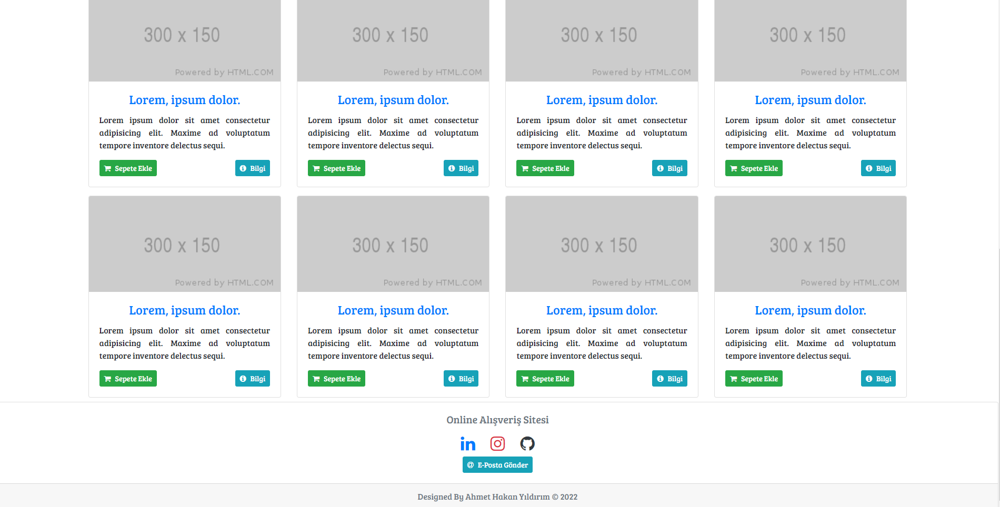

-------;

## Kayıt Ol (Sign Up)

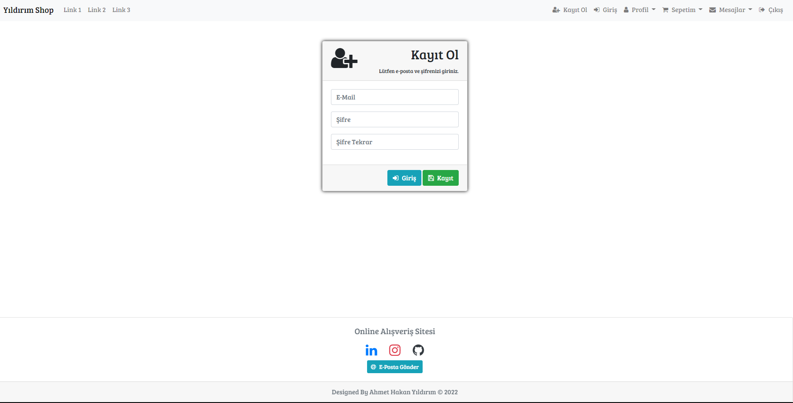

-------;

## Giriş Yap (Login)

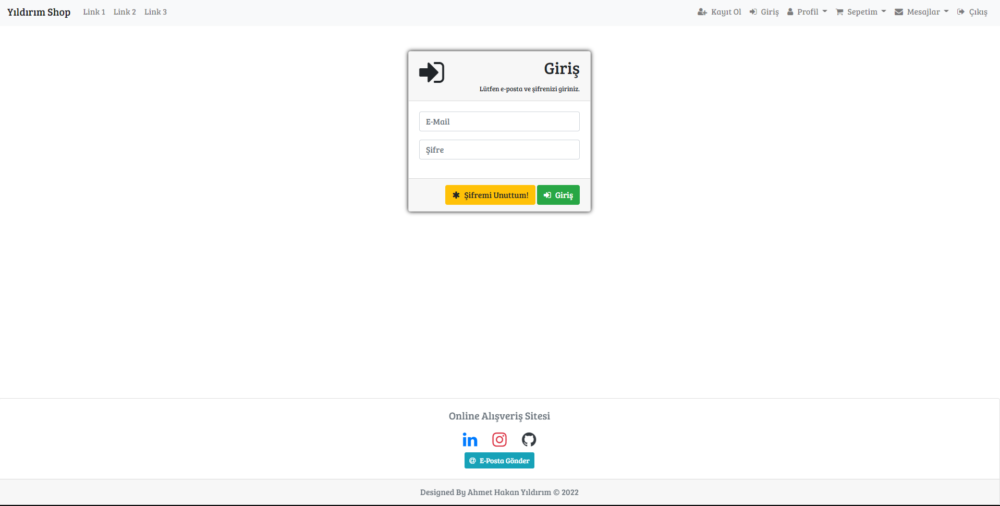

-------;

## Şifremi Unuttum (I forgot my password)

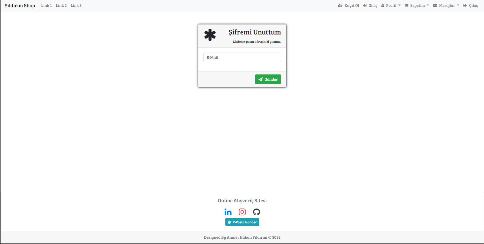

-------;

## Profilim (My Profile)

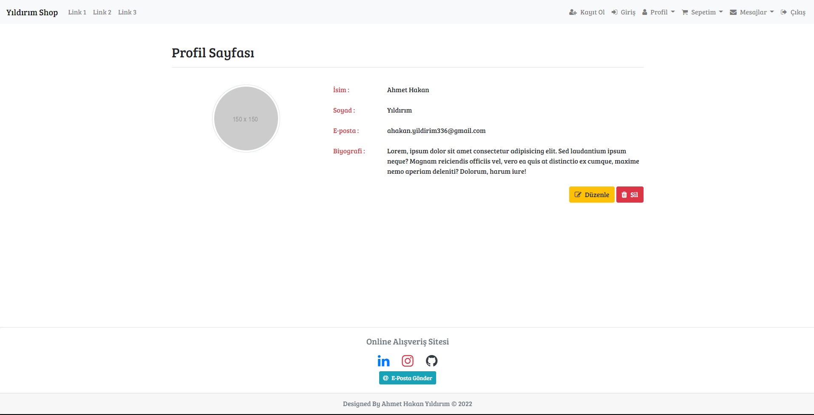

-------;

## Adreslerim (My Adresses)

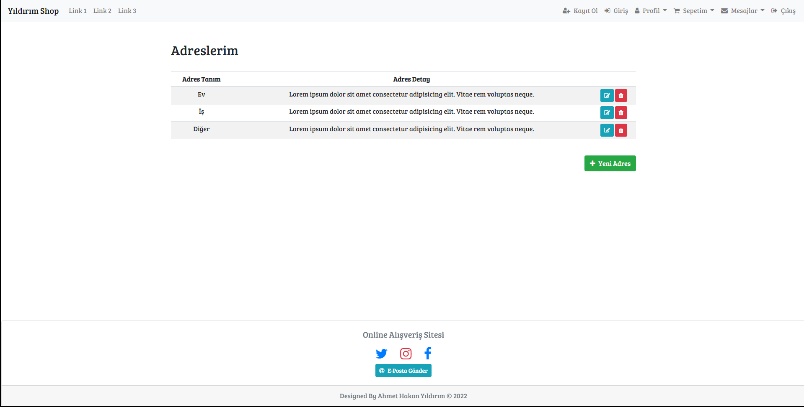

-------;

## Siparişlerim (My Orders)

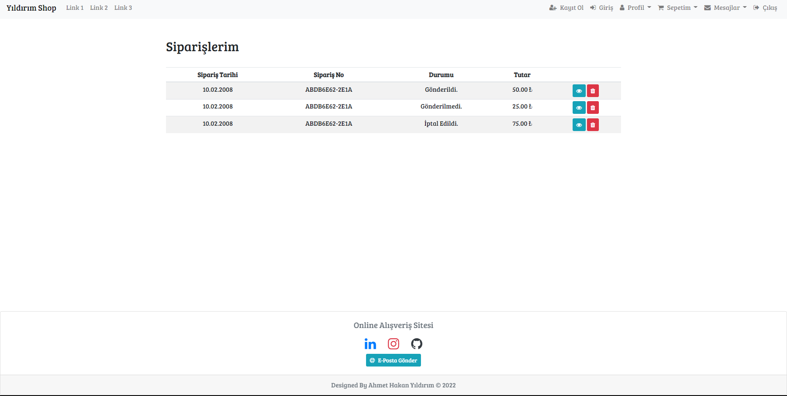

-------;

## Ürün (Product)

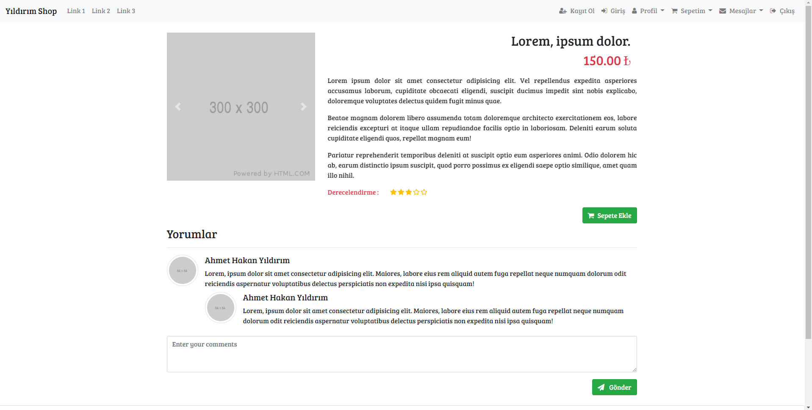

-------;

## Sepet (Cart)

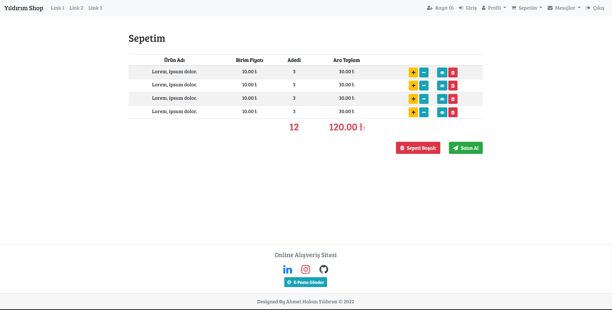

-------;

## Mesaj Detay (Message Detail)

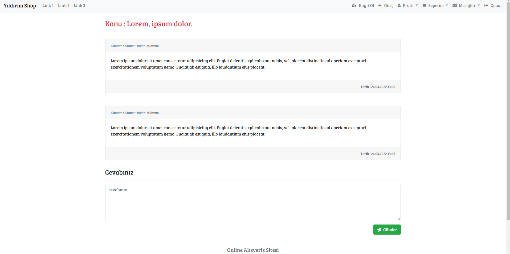

-------;

## Mesajlar (Messages)

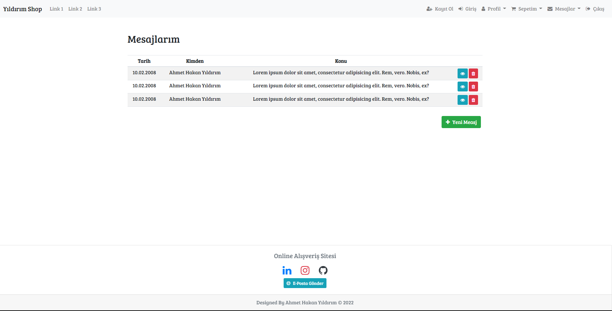

-------;
